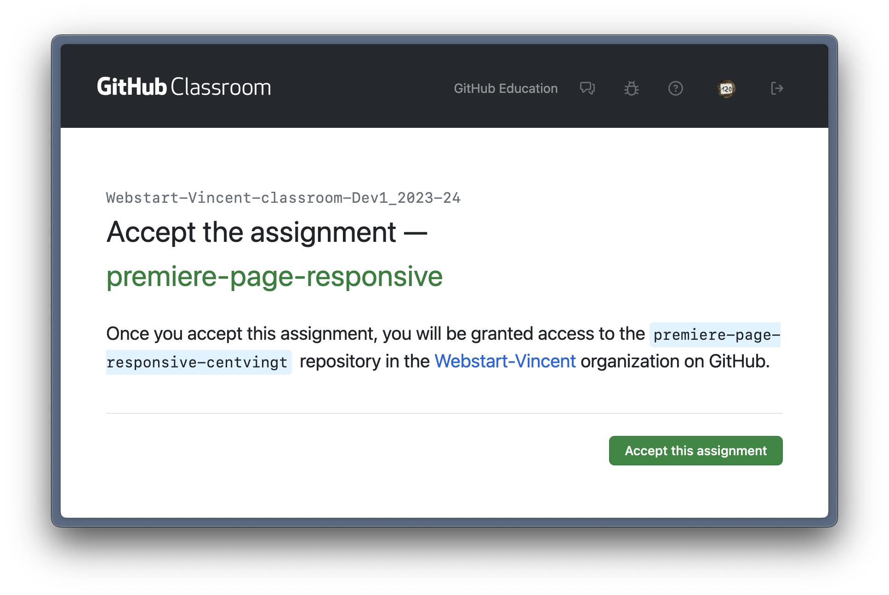
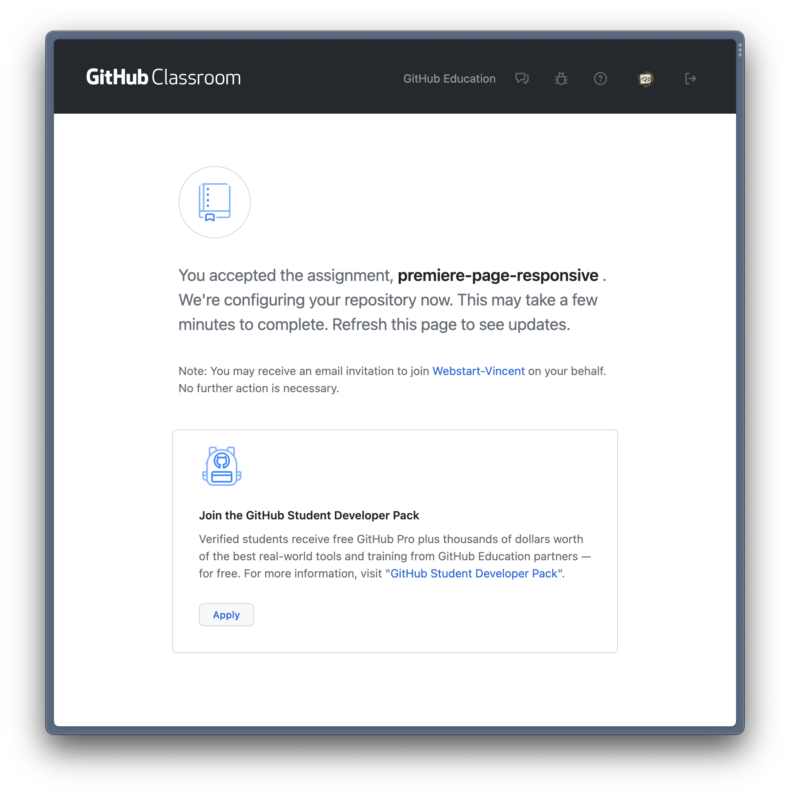
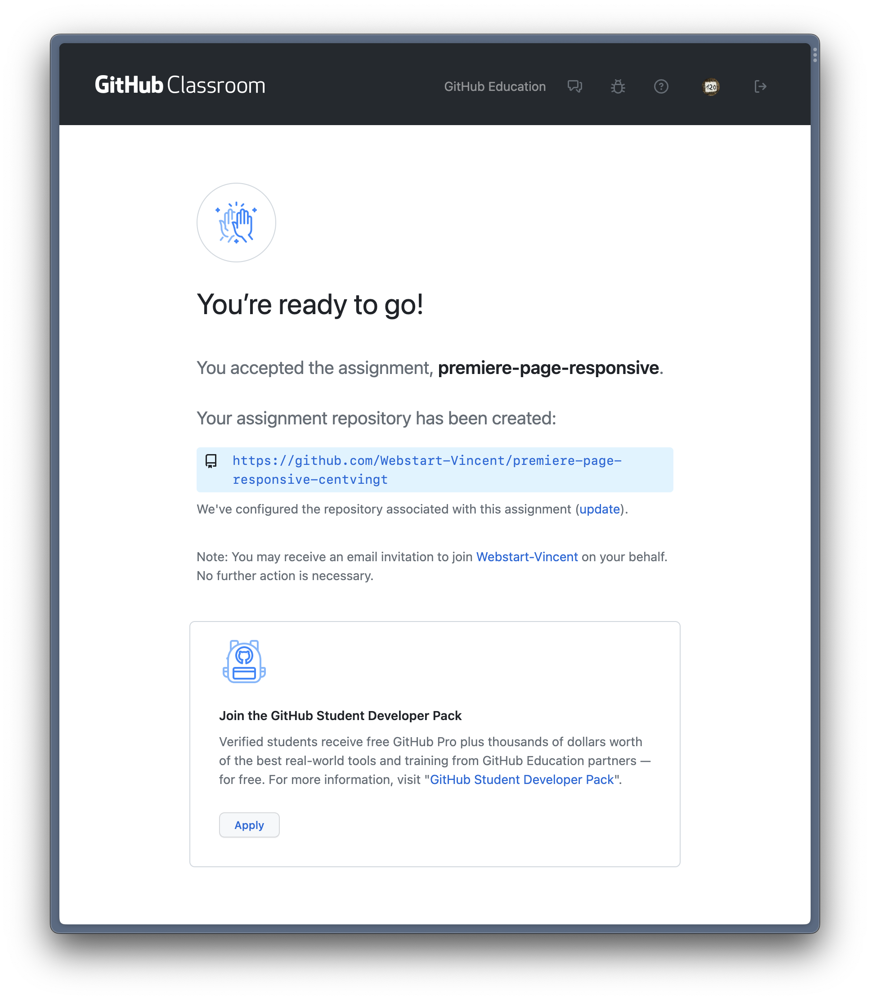
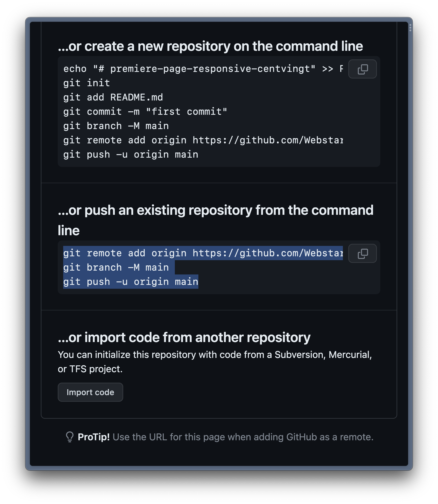

# Rappel Git/GitHub

Savoir sur quelle branche on est :

```bash
$ git branch
* main
$
```

Savoir s’il y a des modification à _commiter_ :

```bash
$ git status
On branch main
Your branch is up to date with 'origin/main'.

Changes not staged for commit:
  (use "git add <file>..." to update what will be committed)
  (use "git restore <file>..." to discard changes in working directory)
	modified:   index.html

no changes added to commit (use "git add" and/or "git commit -a")
$
```

Pour faire un _commit_ et l’envoyer sur GitHub :

1. Ajouter tous les fichiers au _commit_ :
   ```bash
   $ git add .
   ```
1. rédiger le message du _commit_ puis faire le commit:
   ```bash
   $ git commit -m "Add comments"
   ```
1. _push_ le _commit_ vers GitHub :
   ```bash
   $ git push origin main
   ```

<hr>

# Rendre votre devoir

1. Suivez ce lien : <https://classroom.github.com/a/M-ls5TSc>,
1. vous arrivez sur cette page et vous cliquez sur le bouton `Accept this assignment` :
   
1. puis cette page vous indique que votre dépôt GitHub est configuré :
   
1. vous rechargez la page et vous arrivez ici, cliquez sur le lien bleu :
   
1. en suivant le lien de bleu de l’étape précédente, vous arrivez sur cette page et vous tapez ces trois lignes proposées par GitHub mais en remplaçant les deux mots `origin` par `classroom` :
   
